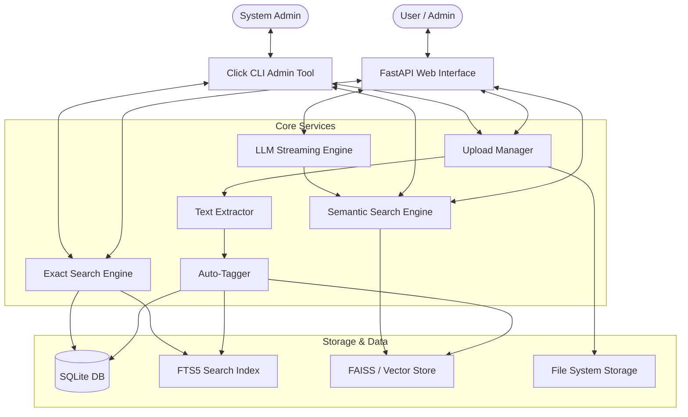

# Office Legal File Manager Architecture

## 1. System Overview
The Office Legal File Manager is a centralized document management solution designed for corporate environments. It allows multiple departments (e.g., HR, Legal, Finance) to securely upload, store, auto-tag, and intelligently search through thousands of documents. Key features include full-text extraction from PDFs and Office files, OCR for scanned images, automatic metadata tagging, and a semantic (hybrid) search engine capable of understanding the context of queries rather than just keyword matching.

## 2. Architecture Diagram

## 3. Tech Stack Explained

*   **FastAPI**: A modern, fast web framework for building APIs with Python. Chosen for its speed, ease of use, and out-of-the-box support for async operations.
*   **Click & Rich**: Click is used for creating the CLI, handling argument parsing smoothly. Rich is utilized to build beautiful, styled terminal outputs like tables, panels, and progress bars.
*   **SQLite + FTS5**: The primary database. Chosen because it requires no separate server setup, ensuring a simple, highly portable Proof of Concept (PoC). The FTS5 extension provides extremely fast and capable full-text search out of the box.
*   **pdfplumber & python-docx**: Libraries chosen for robust extraction of text from standard office document formats.
*   **pytesseract**: A wrapper for Google's Tesseract-OCR Engine, utilized to extract text from images and scanned PDFs.
*   **scikit-learn & NLTK (RAKE)**: Used for the auto-tagging engine (TF-IDF keyword extraction and phrase identification).
*   **sentence-transformers (MiniLM)**: A lightweight, highly efficient transformer model used to convert text snippets into high-dimensional semantic vectors.
*   **FAISS / NumPy**: Used for storing and rapidly querying the vector embeddings for semantic search.

## 4. Database Design

### SQLite Schema
The system uses a simple but effective normalized schema:
*   `departments`: Stores department names (isolated workspaces).
*   `documents`: Stores document metadata (ID, title, file path, department_id, size, upload date).
*   `document_tags`: Maps tags to documents.

### FTS5 (Full-Text Search)
SQLite's FTS5 extension creates virtual tables that use inverted indexes. Instead of scanning every row for a string (like `LIKE '%term%'`), it stores a map of words to the rows containing them. This turns a search that would take seconds on thousands of files into one that takes milliseconds. Triggers are used in SQLite to automatically keep the FTS virtual table in sync with inserts, updates, and deletes in the `documents` table.

### Department Isolation
Security and separation are handled natively at the query level. Every `SELECT` query enforcing user searches explicitly filters by `department_id`, ensuring cross-department data leakage is mechanically impossible at the database layer.

## 5. Text Extraction Pipeline

1.  **PDFs**: Processed via `pdfplumber`. It iterates page-by-page, extracting structural text.
2.  **DOCX**: Processed via `python-docx`. It iterates through paragraphs and tables, aggregating the textual content.
3.  **Images / Scans**: If a file is an image, `pytesseract` invokes the local Tesseract OCR engine to identify characters within the pixel data and output a raw text string.
4.  **Fallbacks**: If standard extraction fails (e.g., a PDF is actually a scanned image), the system can fallback to rendering the PDF as an image and passing it to OCR.

## 6. Auto-Tagging Engine

The auto-tagging process reduces the manual labor of categorizing documents.

*   **TF-IDF (Term Frequency-Inverse Document Frequency)**: It measures how important a word is to a document relative to a corpus. If a word appears frequently in one document but rarely across all others (e.g., "Subpoena"), it gets a high score and is selected as a tag.
*   **RAKE (Rapid Automatic Keyword Extraction)**: An algorithm that determines key phrases in a body of text by analyzing word frequencies and co-occurrences.
*   The output of both engines is combined, normalized (lowercased, stripped of punctuation), and deduplicated to yield 5-10 highly relevant metadata tags.

## 7. Semantic Search Engine

Traditional search fails if a user types "rental contract" but the document says "lease agreement". Semantic search solves this.

*   **MiniLM & Transformer Models**: The text extracted from the document is fed into the `sentence-transformers` model. This model understands language semantics and outputs a 384-dimensional vector (a list of 384 numbers).
*   **Concept Vectors**: Conceptually, these 384 dimensions represent various linguistic traits. Sentences with similar meanings will have vectors that point in roughly the same direction in this 384-dimensional space.
*   **Cosine Similarity**: When a user searches, their query is also converted to a vector. We calculate the Cosine Similarity (the cosine of the angle between the two vectors). A score closer to 1.0 means high similarity; 0 means unrelated.
*   Vectors are stored efficiently on disk using `.npy` files or a vector database like FAISS for fast nearest-neighbor lookups.

## 8. Hybrid Search Strategy (Decoupled Production Architecture)

In a production environment, exact matches must be instantaneous while semantic/AI operations are heavier. Thus, the search is fully decoupled:
1.  **FTS5 Exact Search (`/api/search/exact`)**: Triggers instantly on keystroke. Retrieves exact keyword matches in milliseconds.
2.  **Semantic Search (`/api/search/semantic`)**: Triggers after a debounce. Retrieves conceptually similar documents via ChromaDB and assigns a cosine similarity score.
3.  **Cross-Encoder Re-Ranking**: Reranks the top semantic results using `ms-marco-MiniLM` for ultra-high precision.
4.  **LLM Token Streaming (`/api/rag`)**: Uses Server-Sent Events (SSE) to stream generated RAG answers token-by-token directly to the UI, resulting in zero perceived latency.

## 9. Department Isolation Security Model

The system utilizes a hard-scoped architectural security model:
*   **Query Level**: As mentioned, `WHERE department = ?` is enforced on all database queries.
*   **Auth Level (PoC)**: Basic session/cookie management establishes the user's department context upon login. (In production, this translates to JWT claims).
*   **Storage Level**: The filesystem is partitioned physically: `/data/<department_name>/<file_uuid>.pdf`. A user in HR cannot physically traverse to the Legal directory.

## 10. File Processing Flow

1.  User authenticates and uploads `contract.pdf` via WebUI or CLI.
2.  FastAPI receives the file, validates its size and extension.
3.  The file is saved to `/data/legal/uuid.pdf`.
4.  A database record is created in SQLite.
5.  The **Extractor** parses `contract.pdf` into a raw text string.
6.  The **Tagger** processes the string, generating tags like `[lease, contract, term]`.
7.  The **Embedder** converts the text into a 384D vector.
8.  The Database is updated with the tags, FTS is populated, and the vector is saved.
9.  The file is now immediately searchable.

## 11. API Reference

*   `POST /auth/login` - Authenticates user into a department session.
*   `GET /api/documents` - Lists files for the current department.
*   `POST /api/upload` - Multipart form upload endpoint.
*   `GET /api/search/exact?q=query` - Performs the instant exact keyword search.
*   `GET /api/search/semantic?q=query` - Performs the semantic embedding search.
*   `GET /api/rag?q=query` - Streams the LLM RAG response via Server-Sent Events (SSE).
*   `DELETE /api/documents/{id}` - Soft/Hard deletes a file.

## 12. CLI Reference

*   `python cli.py stats` - View total file counts, sizes, and system health.
*   `python cli.py add-department <name>` - Bootstrap a new isolated department workspace.
*   `python cli.py list-departments` - View all active departments.
*   `python cli.py list-files --department <name>` - View files within a specific workspace.
*   `python cli.py reindex [--department <name>]` - Rebuilds text extractions, tags, and semantic embeddings if models update or data corrupts.
*   `python cli.py upload --file <path> --department <name> --title <title>` - Ingests local files into the system directly.
*   `python cli.py search --department <name> --query <text>` - Execute semantic searches directly from the terminal.

## 13. Performance Characteristics

*   **Upload & Processing**: ~1-3 seconds for a standard 10-page text PDF. ~5-15 seconds for image-based OCR PDFs.
*   **FTS Search**: < 10ms for millions of rows.
*   **Semantic Search**: ~50-100ms for computing the query vector and running cosine similarity over thousands of vectors.
*   **Total Search Latency**: Usually < 150ms.

## 14. Future Improvements for Production

While robust, this Proof of Concept should be upgraded before enterprise deployment:
1.  **Database Upgrade**: Migrate from SQLite to PostgreSQL for better concurrency. Use `pgvector` for native vector search and `tsvector` for FTS.
2.  **Authentication**: Implement OAuth2 + JWT tokens mapped to Active Directory groups instead of simple session cookies.
3.  **Async Processing**: Move the Extractor, Tagger, and Embedder to background workers (e.g., Celery + Redis). Returning an immediate 202 Accepted to the user while processing happens asynchronously.
4.  **Cloud Storage**: Replace local file system with AWS S3 or Azure Blob Storage.
